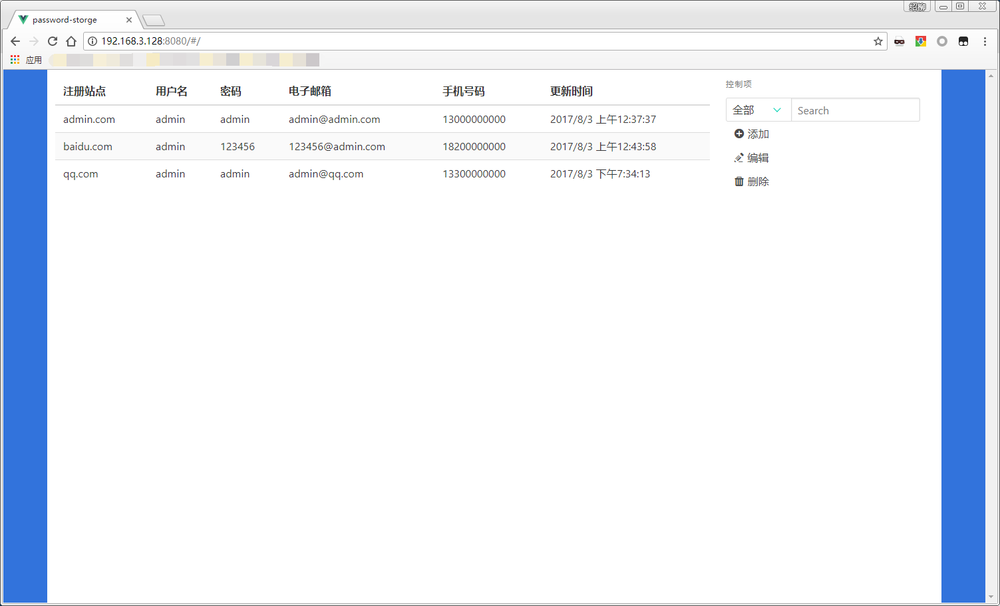

# password-store
基于 vue.js, python3.x, sqlite3，用于存储个人密码的仓库

说到账户安全，我就是懒得记住各种各样的密码，什么虚拟机密码啊，什么网站密码，什么数据库密码啊乱七八糟的，随手写了一个密码存储的工具。用了点之前没学过的姿势，代码很烂。

## 准备工作
1、安装一个数据库，默认使用 sqlite3，下载地址：https://www.sqlite.org/download.html

2、安装 node.js，下载地址：http://nodejs.cn/download/

3、安装 Python3.x 版本，下载地址：

我平时开发轻量应用使用的3件套，数据存储在 python/dist/database.db 中，保存好这个文件即可，数据库也没加密。

## 安装依赖
第一次启动，安装依赖文件

安装前端依赖文件

    cd html
    npm i
    
安装后端依赖文件

    cd python
    pip install -r requirements.txt

## 启动方法
需要两个 shell 窗口

前端启动

    cd html
    npm run dev

后端启动

    cd python
    python app.py

启动后访问 localhost:8080 即可看到管理界面

## 个人配置
所有可修改的配置都在 config 文件中

前端配置

html/src/config/index.js

后端配置

python/config.py